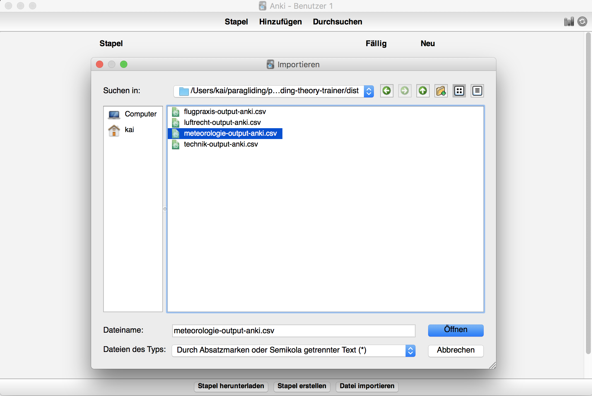

# Paragliding Theory to Anki Deck

**Problem**
People who don't have a Windows computer want to learn for the Paragliding License exam in Germany.

**Solution**
A script that converts [DHV](https://www.dhv.de) questions to an [Anki](https://apps.ankiweb.net/) deck.
Note that the latest deck **ONLY** covers [A-License questions](https://www.dhv.de/web/piloteninfos/ausbildung/ausbildung-gleitschirm/ausbildungsabschnitte-gleitschirm/ausbildung-zum-a-schein/).

## How to learn with the latest Anki deck

- Download & install Anki: https://apps.ankiweb.net/
- Download all CSV files from [the latest anki deck files](https://github.com/Kadrian/paragliding-questions-to-anki/tree/master/dist)
- Import them into Anki, one Deck per CSV (check HTML usage)

- Open images from the PDFs in [originals](https://github.com/Kadrian/paragliding-questions-to-anki/tree/master/originals) on the side
- Start learning

## What does the script do?

The script (`convertToAnki.js`) was used to convert the initial questions from basic text format into Anki-compatible CSV files. These CSV files contain a little bit of HTML, so Anki displays the cards nicely.

The script is a simple [node](https://nodejs.com) script that looks for the inputs in the `manually-cleaned` folder and outputs Anki-compatible `csv` files in the `dist` folder.

## How to use the script

**Setup node**

You will need an OS X / unix machine for our development scripts to work.

You need at least node 6:

- install nvm https://github.com/creationix/nvm)
- add the necessary lines to your `.bash_profile` / `.zshrc` or similar.

```
nvm install 6
```

**Execute**

```
node convertToAnki.js
```
